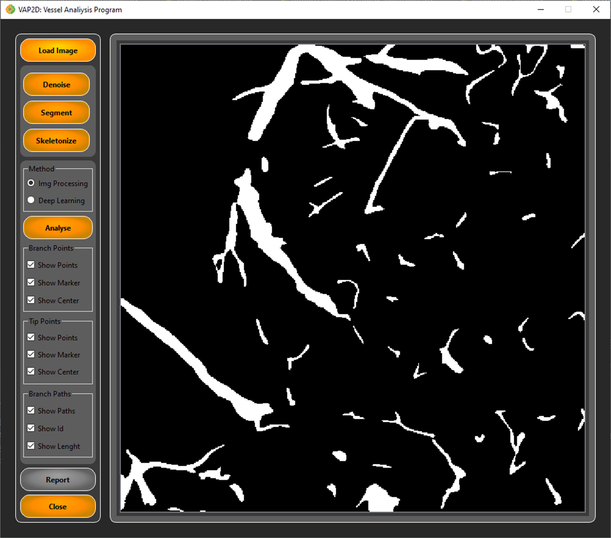
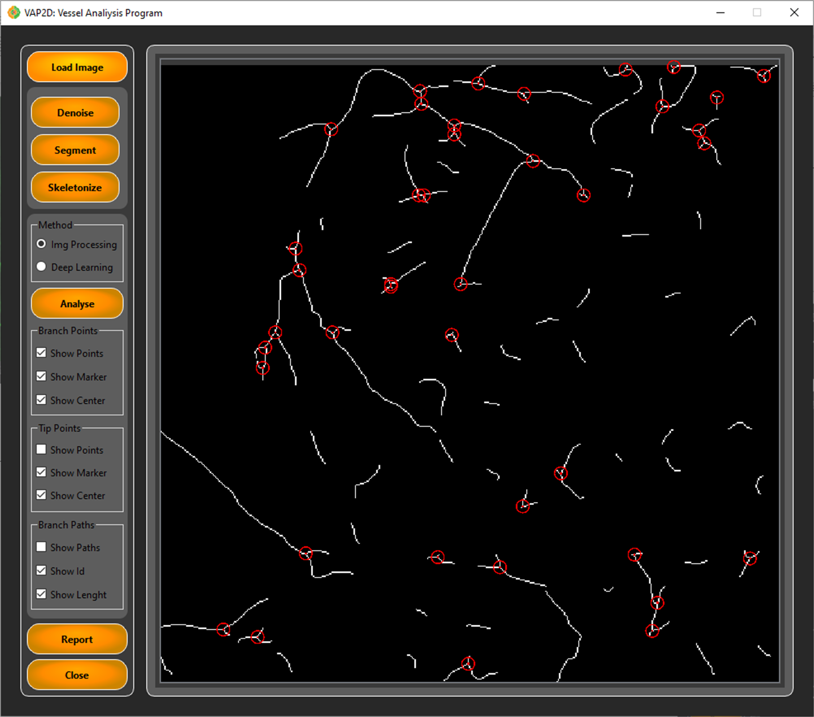
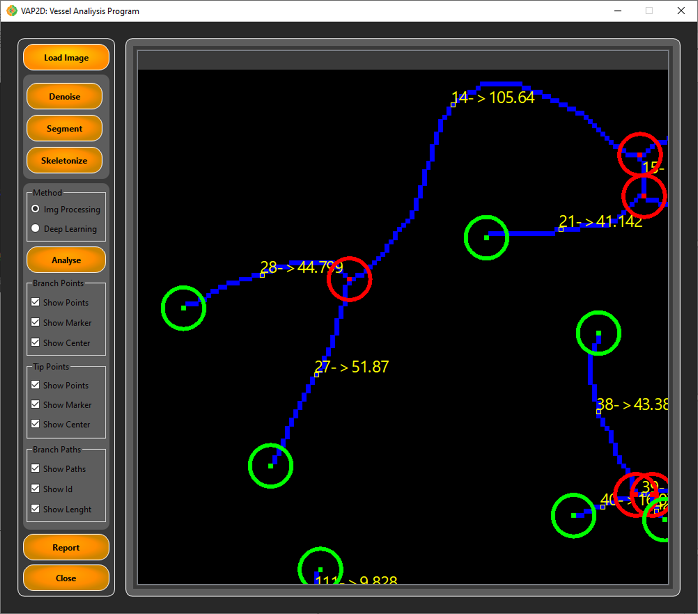
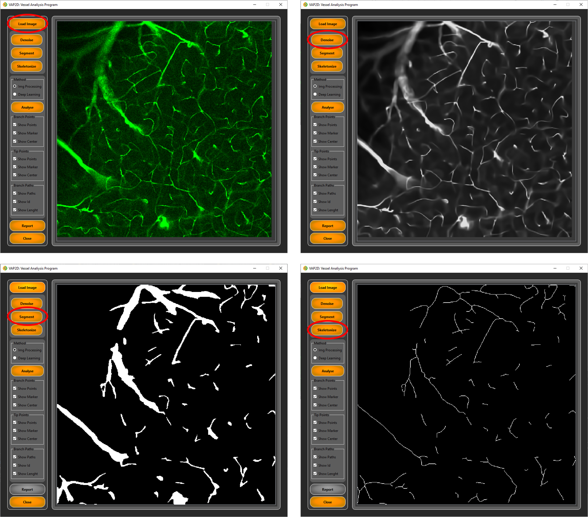
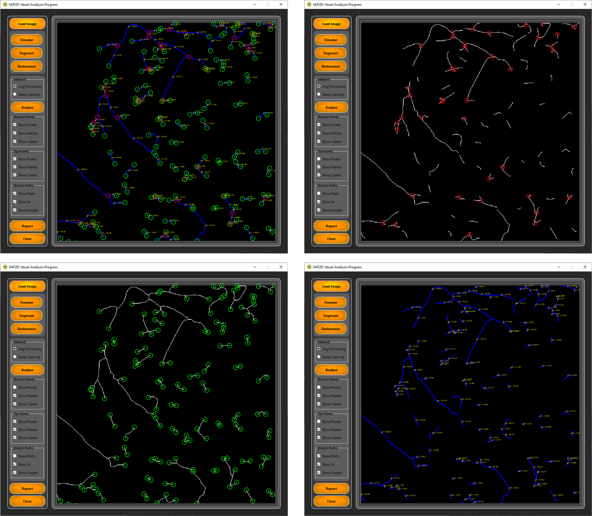
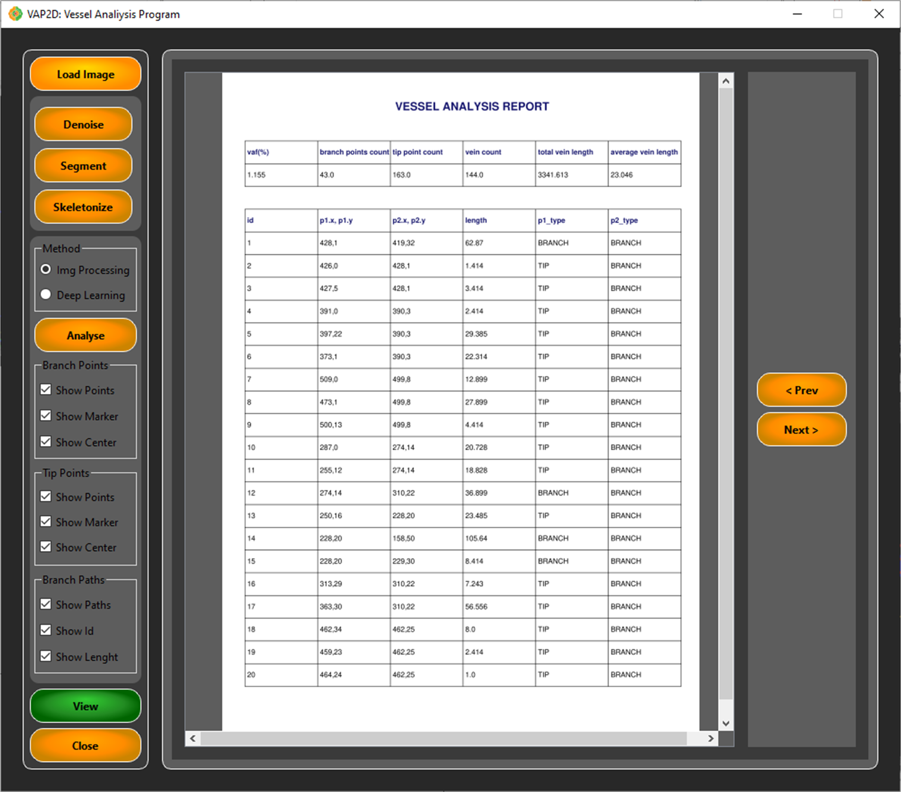

# VAP2D - Visual Analysis Platform for 2D Data

VAP2D is a visual analysis and data processing platform for two-dimensional data. This software allows users to easily analyze, visualize, and extract meaningful insights from 2D data.

## Features

- **Data Visualization**: Analyze your 2D data with graphs and visual tools.
- **Data Processing**: Perform various operations on your data.
- **User-Friendly Interface**: Simple and intuitive interface for easy usage.
- **Flexible Structure**: Supports different types of data and is customizable.

## Installation

Follow the steps below to get started with this project:

### Requirements

- Python 3.8 or higher
- Required Python libraries (listed in `requirements.txt`)

### Steps

1. Clone the repository:

   ```bash
   git clone https://github.com/sametkaya/vap2d.git
   cd vap2d
   ```

2. Install the required dependencies:

   ```bash
   pip install -r requirements.txt
   ```

3. Run the application:

   ```bash
   python main.py
   ```

## Usage

1. After starting the application, you can load your data and use the analysis tools from the main menu.
2. Use the visualization options to display your data as graphs.
3. Process and analyze your data using the available tools.
   
## Screens

<h4>Load raw image</h4>

<h4>Denoising</h4>

<h4>Segmentation</h4>

<h4>Analyse</h4>

<h4>Show only branch points</h4>

<h4>Show only endpoints</h4>

<h4>Show only vessel path with infos</h4>

<h4>Zooming</h4>

<h4>All Prepocesses</h4>

<h4>All view actions</h4>


<h4>Report Screen</h4>

## Contributing

If you would like to contribute, please follow these steps:

1. Fork this repository.
2. Create a new branch: `git checkout -b new-feature`
3. Make your changes and commit them: `git commit -m 'Add new feature'`
4. Push your branch: `git push origin new-feature`
5. Open a Pull Request.

## License

This project is licensed under the [GNU GENERAL PUBLIC LICENSE v.3](LICENSE). For more details, see the `LICENSE` file.

## Contact

If you have any questions or suggestions, feel free to contact [sametkaya](https://github.com/sametkaya).

---

This project is designed to simplify 2D data analysis and visualization processes. We welcome your contributions and feedback!
