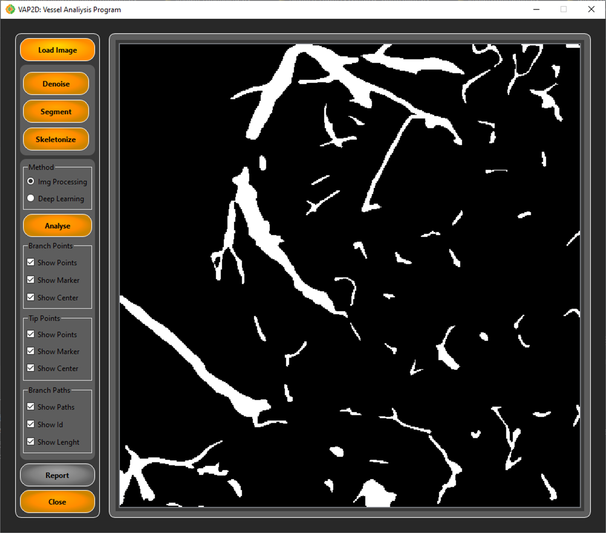
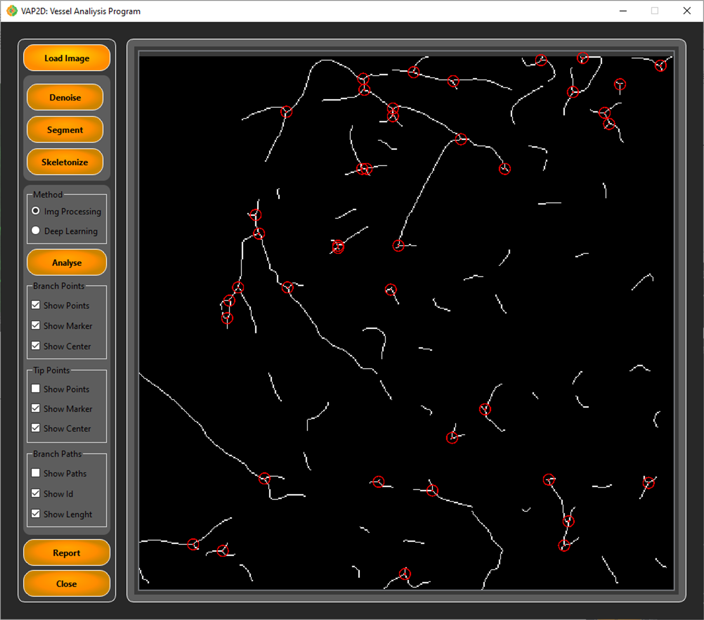
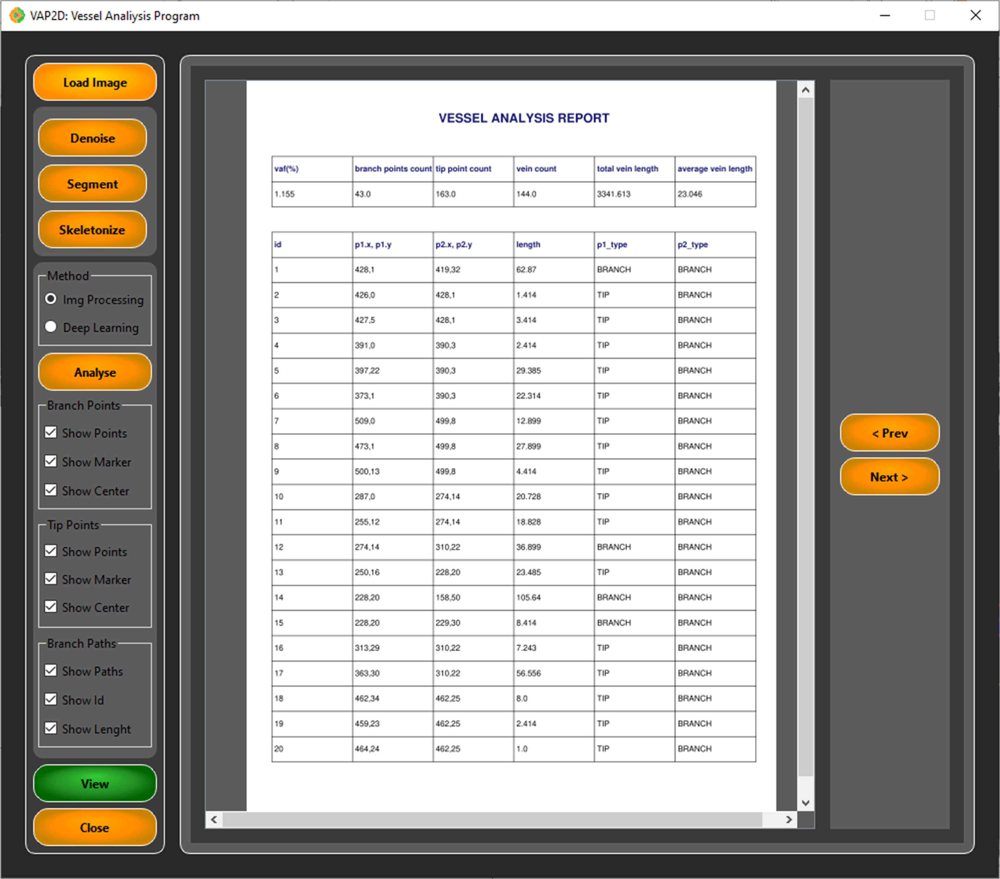

# VAP2D - Vessel Analysis Program for 2D Images

[](https://www.gnu.org/licenses/gpl-3.0)
[](https://www.python.org/downloads/)
[](https://github.com/sametkaya/vap2d)

VAP2D is a **cross-platform**, open-source software for quantitative analysis of 2D vessel images. It enables automated detection of branch points and endpoints, calculation of vessel lengths and densities, and generation of detailed reports using both **Traditional Image Processing (TIP)** and **Deep Learning (DL)** methods.

## ✨ Features

- **🔬 Vessel Analysis**: Detect branch points, endpoints, vessel paths, and calculate lengths/densities
- **🤖 Dual Detection Methods**: Choose between Traditional Image Processing (TIP) or Deep Learning (DL)
- **⚙️ Pre-processing Pipeline**: Noise removal, segmentation, and skeletonization
- **📊 Report Generation**: Export results in CSV or PDF format
- **🖥️ User-Friendly GUI**: Intuitive PySide6-based interface
- **🌐 Cross-Platform**: Runs on Windows, Linux, and macOS
- **🐳 Docker Support**: Easy deployment with containerized environment

---

## 📁 Repository Structure

```
vap2d/
├── main.py                 # Application entry point
├── requirements.txt        # Python dependencies
├── Dockerfile              # Docker configuration
├── LICENSE                 # GPL-3.0 license
│
├── DeepLearning/           # Deep Learning detection module
│   ├── DeepLearningObjectDetection.py  # DL-based branch/endpoint detection
│   └── model/              # Pre-trained Faster R-CNN model weights
│
├── System/                 # Core processing modules
│   ├── ImageOperation.py   # TIP methods (morphological filters, hit-or-miss)
│   ├── Skeletonize.py      # Medial axis transform for skeletonization
│   ├── Segmentation.py     # Threshold-based segmentation
│   └── Denoise.py          # Noise filtering algorithms
│
├── Windows/                # GUI window classes
│   ├── MainWindow.py       # Main application window
│   ├── AnalysisWindow.py   # Analysis and visualization
│   └── ReportWindow.py     # Report generation interface
│
├── GraphicItems/           # Custom Qt graphic items for visualization
│
├── detectron2/             # Facebook's Detectron2 library (for DL mode)
│                           # Pre-configured for Faster R-CNN object detection
│
├── Resources/              # Application resources (icons, styles)
│
├── sample_data/            # 📂 SAMPLE DATASET FOR TESTING
│   └── hfhs13/             # Henry Ford Health System dataset
│       ├── raw/            # Original vessel images (100 images)
│       ├── skeleton/       # Pre-skeletonized binary images
│       └── expected_output/# Reference analysis results
│
└── doc/
    └── screens/            # Application screenshots
```

### Key Components Explained

| Directory | Description |
|-----------|-------------|
| `System/ImageOperation.py` | **TIP Methods**: Contains morphological filters for detecting 8 branch point patterns and 16 endpoint patterns using hit-or-miss algorithm |
| `DeepLearning/` | **DL Methods**: Faster R-CNN model (AP=0.989 at IoU=0.50) with hybrid post-processing for precise center localization |
| `detectron2/` | Facebook's object detection library, pre-configured for our vessel detection task |
| `sample_data/hfhs13/` | **Test Dataset**: 100 cerebral vessel images from Henry Ford Health System for reproducibility testing |

---

## 📦 Sample Data

The repository includes the **HFHS13 dataset** containing 100 2D cerebral vessel images for testing and validation:

```
sample_data/hfhs13/
├── raw/                    # Original grayscale vessel images
│   ├── image_001.png
│   ├── image_002.png
│   └── ... (100 images)
├── skeleton/               # Binary skeleton images (ready for analysis)
│   ├── image_001_skeleton.png
│   └── ...
└── expected_output/        # Reference results for validation
    ├── image_001_results.csv
    └── ...
```

### Supported Input Formats

| Input Type | Description | Requirements |
|------------|-------------|--------------|
| **Raw Images** | Grayscale vessel images | Use pre-processing (denoise → segment → skeletonize) |
| **Binary Skeleton** | Pre-skeletonized images | Direct analysis without pre-processing |
| **Formats** | PNG, TIFF, BMP, JPEG | 8-bit grayscale recommended |

---

## 🚀 Quick Start

### Option 1: Docker (Recommended)

```bash
# Pull and run with GUI support (Linux)
docker pull sametkaya/vap2d:v2.2
docker run -e DISPLAY=$DISPLAY -v /tmp/.X11-unix:/tmp/.X11-unix sametkaya/vap2d:v2.2
```

### Option 2: Local Installation

```bash
# 1. Clone the repository
git clone https://github.com/sametkaya/vap2d.git
cd vap2d

# 2. Create virtual environment
python -m venv venv_vap2d

# 3. Activate virtual environment
# On Windows:
venv_vap2d\Scripts\activate
# On Linux/macOS:
source venv_vap2d/bin/activate

# 4. Install dependencies
pip install -r requirements.txt

# 5. Run the application
python main.py
```

---

## 📖 Quick Start Example Workflow

Here's a minimal example to analyze a vessel image:

### Step 1: Load Sample Image
```
1. Click "Load Image" button
2. Navigate to: sample_data/hfhs13/raw/
3. Select any image (e.g., image_001.png)
```

### Step 2: Pre-process (for raw images)
```
1. Click "Denoise" → Removes noise artifacts
2. Click "Segment" → Enhances vessel structures  
3. Click "Skeletonize" → Converts to binary skeleton
```

### Step 3: Analyze
```
1. Select detection method:
   - "Img Processing" → Traditional Image Processing (faster, no GPU needed)
   - "Deep Learning" → DL-based detection (more robust, GPU recommended)
2. Click "Analyze" button
3. View detected branch points (green) and endpoints (red)
```

### Step 4: Export Results
```
1. Click "Report" button
2. Choose CSV or PDF format
3. Results include: vessel count, lengths, densities, coordinates
```

---

## 🤖 Detection Methods

### Traditional Image Processing (TIP)
- **No GPU required** - runs on CPU
- Uses morphological hit-or-miss algorithm
- Detects 8 branch point patterns and 16 endpoint patterns
- Best for: Clean, high-contrast skeleton images

### Deep Learning (DL)
- **GPU recommended** (NVIDIA CUDA 11.8+) but works on CPU
- Pre-trained Faster R-CNN model included
- Hybrid approach: DL detection + TIP post-processing for precise centers
- Best for: Noisy images, complex vessel structures

### Pre-trained Model Information
- **Model**: Faster R-CNN with ResNet-50 backbone
- **Performance**: AP = 0.989 at IoU=0.50 (after hyperparameter optimization)
- **Location**: `DeepLearning/model/`
- **Retraining**: Not required for standard vessel images. For custom datasets, see our papers [7, 8] for training procedures.

---

## 💻 System Requirements

### Minimum
| Component | Requirement |
|-----------|-------------|
| OS | Windows 10+, Ubuntu 20.04+, macOS 12+ |
| RAM | 4 GB |
| Storage | 500 MB |
| Python | 3.9+ |

### Recommended (for Deep Learning mode)
| Component | Requirement |
|-----------|-------------|
| RAM | 16 GB |
| GPU | NVIDIA GPU with CUDA 11.8+ |
| Storage | 2 GB |

**Note**: Deep Learning mode works on CPU but is significantly slower (~10x). For production use with DL, an NVIDIA GPU is recommended.

---

## 🐳 Docker

### Docker Hub
- **Repository**: https://hub.docker.com/r/sametkaya/vap2d
- **Latest Version**: v2.2
- **Platforms**: Linux (AMD64, ARM64), Windows (via Docker Desktop)

### Platform-Specific Instructions

<details>
<summary><b>🐧 Linux</b></summary>

```bash
docker run -e DISPLAY=$DISPLAY -v /tmp/.X11-unix:/tmp/.X11-unix sametkaya/vap2d:v2.2
```
</details>

<details>
<summary><b>🪟 Windows</b></summary>

1. Install [VcXsrv](https://sourceforge.net/projects/vcxsrv/)
2. Start with "Disable access control" enabled
3. Run:
```bash
docker run -e DISPLAY=host.docker.internal:0 sametkaya/vap2d:v2.2
```
</details>

<details>
<summary><b>🍎 macOS</b></summary>

1. Install [XQuartz](https://www.xquartz.org/)
2. Enable "Allow connections from network clients"
3. Run:
```bash
docker run -e DISPLAY=host.docker.internal:0 sametkaya/vap2d:v2.2
```
</details>

---

## 📸 Screenshots

<details>
<summary><b>View All Screenshots</b></summary>

| Step | Screenshot |
|------|------------|
| Load Raw Image |  |
| Denoising |  |
| Segmentation |  |
| Analysis Results |  |
| Branch Points |  |
| Endpoints |  |
| Vessel Paths |  |
| Report |  |

</details>

---

## 🛠️ Troubleshooting

<details>
<summary><b>Common Issues</b></summary>

**Import errors:**
```bash
pip install -r requirements.txt --upgrade
```

**Deep Learning not working:**
- Ensure PyTorch is installed with CUDA support
- Check GPU compatibility: `python -c "import torch; print(torch.cuda.is_available())"`

**Docker GUI issues:**
- Linux: Run `xhost +local:docker` before container
- Windows: Ensure X server is running with access control disabled

</details>

---

## 📚 Citation

If you use VAP2D in your research, please cite:

```bibtex
@article{vap2d2025,
  title={VAP2D: A Program for Quantitative Analysis of 2D Vessel Images},
  author={Kaya, Samet and Dik, Sümeyye Zülal and Kiraz, Berna},
  journal={Journal of Open Research Software},
  year={2025},
  note={Under Review}
}
```

### Related Publications
- [Branch and End Points Detection using Deep Learning](https://doi.org/10.2339/politeknik.1492002) - Journal of Polytechnic, 2024
- [Hyperparameter Optimization for Vessel Detection](https://doi.org/10.1109/ASYU62119.2024.10757007) - IEEE ASYU, 2024

---

## 📄 License

This project is licensed under the [GNU General Public License v3.0](LICENSE).

---

## 📞 Contact & Support

- **Author**: Samet Kaya
- **Email**: skaya@fsm.edu.tr
- **GitHub Issues**: [Open an issue](https://github.com/sametkaya/vap2d/issues)
- **Institution**: Fatih Sultan Mehmet Vakıf University, Istanbul, Turkey

For questions, bug reports, or feature requests, please [open an issue](https://github.com/sametkaya/vap2d/issues) on GitHub or contact via email.

---

## 🙏 Acknowledgements

This work was supported by the Fatih Sultan Mehmet Vakıf University Scientific Research Projects (SRP) Unit under grant number 22022B1Ç01D.

---

**VAP2D** - Making vessel analysis accessible, reproducible, and efficient.